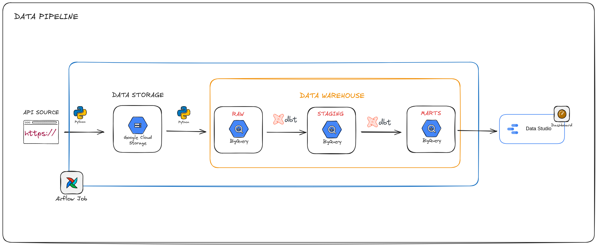

# WikiTrends Indonesia

Pipeline ELT harian untuk mendeteksi artikel Wikipedia Indonesia yang mengalami lonjakan pageviews tidak biasa.

## Pertanyaan Bisnis

Artikel apa yang sedang melonjak tidak wajar di Wikipedia Indonesia hari ini dibandingkan kebiasaan historisnya?

## Jawaban Atas Pertanyaan Bisnis

Pipeline ini membantu menemukan artikel Wikipedia Indonesia yang mengalami lonjakan pembaca dibandingkan pola biasanya.

Caranya, views artikel hari ini dibandingkan dengan rata-rata dan standar deviasi views pada periode sebelumnya. Artikel dengan `z_score > 2` dianggap sebagai kandidat trending. Namun, hasil tersebut tetap dilihat bersama jumlah `views`, `rank`, dan status `is_new_entrant` agar tidak hanya bergantung pada satu metrik.

Dengan begitu, pipeline tidak sekadar menampilkan artikel yang paling banyak dibaca, tetapi juga artikel yang mengalami perubahan perhatian publik secara signifikan. Hasilnya dapat digunakan oleh tim editorial, content strategist, dan data analyst untuk menentukan topik yang perlu diperhatikan atau dianalisis lebih lanjut.

## Arsitektur



## Nilai Bisnis

Pipeline ini mengubah data pageviews mentah menjadi sinyal tren yang dapat digunakan oleh:

- Data analyst untuk menganalisis pola perhatian publik.
- Tim editorial untuk menemukan topik yang sedang ramai.
- Content strategist untuk menentukan topik yang perlu diperbarui.

## Data Model

### Raw

Menyimpan data mentah dari Wikimedia API. Tabel dipartisi berdasarkan pageview_date dan di-cluster berdasarkan article.

### Staging

Membersihkan judul artikel dari kata kunci prefix bawaan wikipedia, seperti:

- Istimewa:\*
- Halaman_Utama
- Portal:\*
- Dan sebagainya

### Marts/Analytics

Menyediakan metrik tambahan seperti:

- average views 28 hari terakhir
- standar deviasi views 28 hari terakhir
- Z-score 28 hari terakhir
- Total views 28 hari terakhir
- Status Artikel Baru/Lama

## Metodologi Deteksi Trending

Pipeline tidak menentukan artikel trending hanya berdasarkan jumlah views
tertinggi. Artikel dibandingkan dengan pola pageviews historisnya sendiri. Dengan pendekatan ini, artikel yang biasanya memiliki sedikit views tetapi
mengalami lonjakan besar tetap dapat terdeteksi sebagai kandidat trending.

Baseline historis menggunakan hingga 28 observasi pageviews sebelumnya, tidak
termasuk hari ini. Baseline tersebut terdiri dari rata-rata views dan standar
deviasi historis.

Z-score dihitung dengan rumus:

$$
z = \frac{x - \mu}{\sigma}
$$

Keterangan:

- $x$: views artikel hari ini.
- $\mu$: rata-rata views historis artikel.
- $\sigma$: standar deviasi views historis.

Artikel dengan `z_score > 2` ditandai sebagai kandidat trending atau anomali positif. Angka 2 dipilih sebagai ambang operasional awal karena menunjukkan views yang berada dua standar deviasi di atas rata-rata. Jika data mengikuti distribusi normal, area di atas nilai tersebut sekitar 2,28%. Untuk angka ambang ini dapat disesuaikan kembali sesuai dengan kesepakatan tim.

Z-score tidak digunakan sendirian. Dashboard juga menampilkan views, rank, rata-rata views dalam 28 hari terakhir, jumlah views dalam 28 hari terakhir, dan status apakah termasuk baru/tidak dalam top list artikel. Dengan demikian, pengguna dapat membedakan artikel yang paling tidak biasa secara statistik dari artikel yang memiliki dampak pembaca terbesar.

Metodologi ini mengacu pada konsep anomaly detection dan outlier detection
dalam literatur statistik:

- Chandola, V., Banerjee, A., & Kumar, V. (2009). _Anomaly Detection: A
  Survey_. ACM Computing Surveys, 41(3).
  https://doi.org/10.1145/1541880.1541882
- Grubbs, F. E. (1969). _Procedures for Detecting Outlying Observations in
  Samples_. Technometrics, 11(1), 1–21.
  https://doi.org/10.1080/00401706.1969.10490657

Referensi tersebut mendukung penggunaan konsep statistik untuk mendeteksi anomali, tetapi tidak menetapkan bahwa `z_score > 2` secara universal berarti sebuah artikel Wikipedia sedang trending. Ambang 2 dalam proyek ini merupakan keputusan desain awal yang masih dapat divalidasi dan disesuaikan berdasarkan hasil evaluasi bisnis.

## Tantangan dan Cara Mengatasinya

- Selama pembuatan project ini tantangan yang paling membantu saya belajar adalah ketika data untuk tanggal hari ini mengembalikan error 404 (not found). Awalnya saya menganggap pipeline rusak, tetapi setelah memeriksa perilaku API, saya memahami bahwa data Wikimedia memiliki keterlambatan publikasi. Solusinya adalah menggeser tanggal ekstraksi dua hari dan memperlakukan 404 sebagai kegagalan yang tidak boleh diretry berulang-ulang.

- Project ini masih berjalan di docker local alhasil untuk membuat pipeline berjalan otomatis secara mandiri, maka docker local harus tetap menyala dan tidak boleh mati.

## Cara Menjalankan Project

- Clone repository.
- Instal pre-requisite: Git, Docker Desktop, Google Cloud CLI, dan UV.
- Buat project baru di GCP.
- Buat bucket GCS.
- Buat dataset Bigquery raw, staging, dan analytics.
- Buat service account dengan role Bigquery Admin dan Cloud Storage Admin (untuk akses penuh) dan unduh credential keys-nya.
- Simpan credential keys di folder `keys/`
- Salin `.env.example` menjadi `.env`.
- Sesuaikan projectID, bucket, region, path credential keys, dan user agent.
- Buat `profiles.yml` dengan path credential container.
- Pastikan Airflow Connection `google_cloud_default` tersedia.
- Jalankan:

```bash
cd  airflow
docker compose --env-file ../.env config
docker compose --env-file ../.env build
docker compose --env-file ../.env up -d
```

- Buka Airflow di localhost:8080.
- Trigger DAG atau Backfill ke rentang waktu tertentu.
- Pastikan docker tetap menyala untuk membuat pipeline tetap berjalan secara otomatis.
